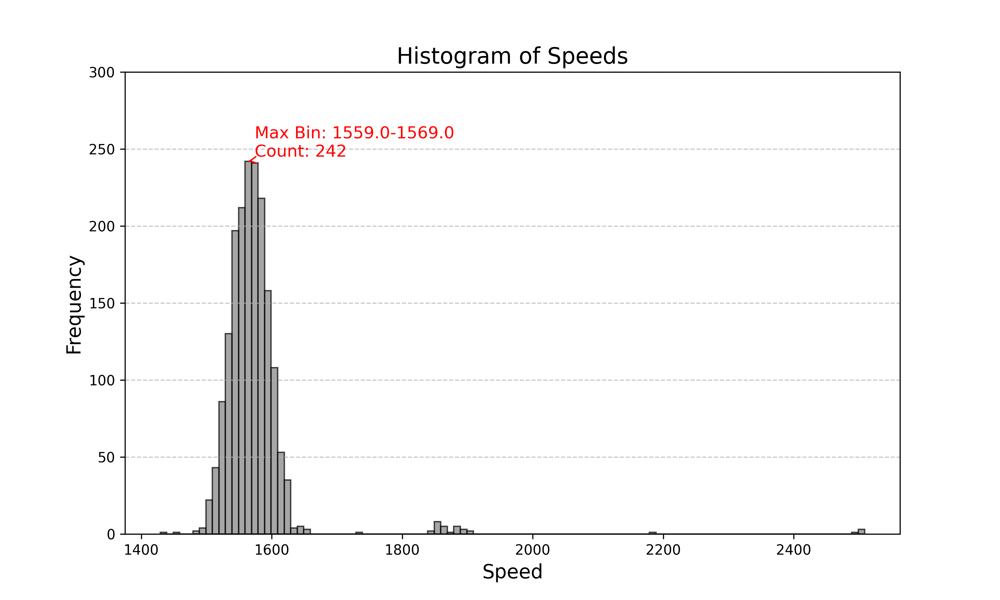

# Conveyer belt Speed

The task is to find the speed of the conveyer belt using a _.svo_ file recorded using ZED SDK Camera module. The following are the steps that are used to complete the task.
# Working

**Introduction:** 
This project aims to dynamically determine the speed of a conveyor belt using SVO recordings captured by a ZED Stereo Camera. The camera records the moving belt at 2X720p resolution, with 60 frames per second. Equipped with two or more lenses, each with a separate image sensor, the stereo camera mimics human vision, enabling it to capture 3D images. The project employs both feature extraction and optical flow methods for this task.

**Requirements:**
* Python 3.6 or higher
* OpenCV -- pip install opencv-python
* NumPy -- pip install numpy
* Pandas -- pip install pandas
* Matplotlib -- pip install matplotlib
* Scipy -- pip install scipy

**Installation:**
* The device should have at least 4GB RAM, and the recommended amount is 8GB.
* It is mandatory to have an NVIDIA GPU, with a recommended model of GTX 2060 or higher
* NVIDIA CUDA Toolkit (this will be installed with ZED SDK).
* Download the ZED SDK version 4.x from [StereoLabs website](https://www.stereolabs.com/developers).
* The detailed commands to follow are [HERE](./Descriptions/commands_to_install_ZED_SDK.md).

**Usage:**
After installation of ZED SDK follow the commands:
* `git clone https://github.com/saivenkatreddy29/conveyor_belt_speed.git`
* `cd conveyor_belt_speed`
* `pip install -r requirements.txt`
* `python3 main.py [args]`

The arguments give you the flexibility to choose method and window in which you want to run the code.
1) method - Choose between _feature_selection_ and _optical_flow_
2) window_size - Choose the _window_size_ that is used to smooth the speed values from fluctuation

**Example:** `python3 main.py --method optical_flow --window_size 5`

# Code structure and functionality

**1. Initialization of ZED SDK Camera:**
The ZED Camera is initialized using the _sl.Camera()_ object. The video path is set and camera is configured for 
performance depth mode. If initialization fails a `RuntimeError` is raised, check the ZED setup.

**2. Setting Up Variables:**
Then we setup the variables that are future used in the program. Key variables include:
* _image_cam,_ _depth_cam_ for storing frame and depth data.
* _prev_depth_map_ to store previous frame's depthmap.
* _speed_queue_ for storing speed values for smoothing.
* _camera_parameters_ to store intrinsic camera parameters.

**3. Choosing Between Feature Extraction and Optical Flow:**
The method is chosen based on input argument _method_. 
* In feature extraction, ORB features are detected and matched using FLANN and RANSAC. 
* Optical Flow, Farneback's algorithm is used to compute motion between the frames.

Detailed explaination about when to use which method and future developement is discussed [HERE](Descriptions/Choosing_method.md).

**4. Feature Extraction (ORB features):**
ORB is fast and efficient for feature detection.
* Fast Keypoint detection: Identifies the keypoints in image by comparing pixel intensities in circular pattern.
* BRIEF Descriptor: Computes binary descriptors for each keypoint by comparing pixel intensities in a predefined pattern around the keypoint.

The keypoints and descriptors are extracted from a specific Region of Interest (ROI), which is cropped from frame using the coordinates provided.

**5. Feature matching (FLANN with RANSAC):**

Feature matching involves finding similarities between keypoints in two frames. 

* FLANN is used to efficiently match descriptors between frames using an approximate nearest neighbors search, which has better computational efficiency than brute-force matching.
* For each descriptor in first frame, two closest matches are found. If the distance ratio between the best and second-best match is below 0.7 (a rule of thumb, but a different value can be chosen), the match is considered reliable.
* RANSAC is used to filter out outliers by estimating the geometric transformation between matched keypoints. More details about RANSAC and improvements on filtering are discussed [HERE](Descriptions/Outlier_handling.md)).

**6. Optical Flow (Farneback method):**
* Optical flow is used to estimate the motion of an object between two consecutive frames with a short time difference by calculating the displacement vector for each pixel (in this case, for every 20 pixels).
* The displacement vector (dx, dy) is retrieved from the flow field. Adding the displacement vectors to the current pixels will give the location of the pixel in the next frame (2D). Using these 2d coordinates and depth maps, we will find the 3D coordinates of the two pixels and then finds the displacement in 3D.

**7. Converting Coordinates:**

* The coordinates are converted from 2D pixel coordinates to 3D world coordinates using intrinsic parameters (focal length and principal points).

**8. Calculating Speed:**

* The displacements are calculated using Euclidean distance between the corresponding 3D points.
* The program uses median displacement to avoid outliers.
* The speed is computed by multiplying the displacement by the frames per second.

# Handling noise and outliers

The program uses RANSAC for outlier detection in the feature extraction method, and the optical flow module has implicit outlier handling by:
* Depth Filtering: Removes invalid depth values (negative, zero and non-finite).
* Median Displacement: Instead of averaging the program uses median displacement to handle outliers.
* Sampling: Due to sampling the impact of noisy regions are reduced.

The program uses a moving average to remove noise in speed measurements. It uses the _window_size_ (default: 5) to minimize the effect of sudden changes in speed and to provide smoother values.

**The following plot gives us idea of how using moving average will help to reduce fluctuations caused by noise.** 

# Output
The output consists of smoothed speed values recorded at each frame and stored in the _results.csv_ file.

**The following image gives us the distribution of speed values at every frame. The plot clearly shows that the speed of the belt lies between 1.55 m/s to 1.56 m/s**

# Observations
As the program implemented two methods for speed detection, I have made few observations about how each method is working.

In the plot we can see that optical flow has smoother curve that feature detection even without using dedicated outlier detection techniques. This is because optical flow computes motion vectors for all pixels (or a dense subset, e.g., every 20 pixels), providing a continuous representation of motion. In contrast, feature extraction relies on sparse keypoints, which can lead to noisier estimates if keypoints are unevenly distributed or mismatched. This doesn't mean that it is always reccomonded to use optical flow because of it's computational cost, as we increase the frequency of comparisions the program requires more computational resources. So, considering this tradeoff the choosing of method should be done.
For example, optical flow is ideal for scenarios requiring smooth motion estimation, while feature extraction is better suited for resource-constrained environments.

# Future Developments

* **Deep learning-based feature extractors:** We can use learned features from pre-trained models such as D2-Net for better feature extraction and matching.

* **Consistency checks:** Comparing the forward and backward optical flow to remove the inconsistent motion vectors.

* **Parallel processing and reduced resolution:** Using multithreading or multiprocessing to handle frame processing can increase the program's speed. Decreasing the resolution of the frames can also improve the computational speed.

* **Kalman Filter:** We can apply kalman filter to smooth the speeds and reduce noise.Currently, a moving average is used, but a Kalman filter can provide significant improvements in terms of accuracy, responsiveness, and adaptability.
